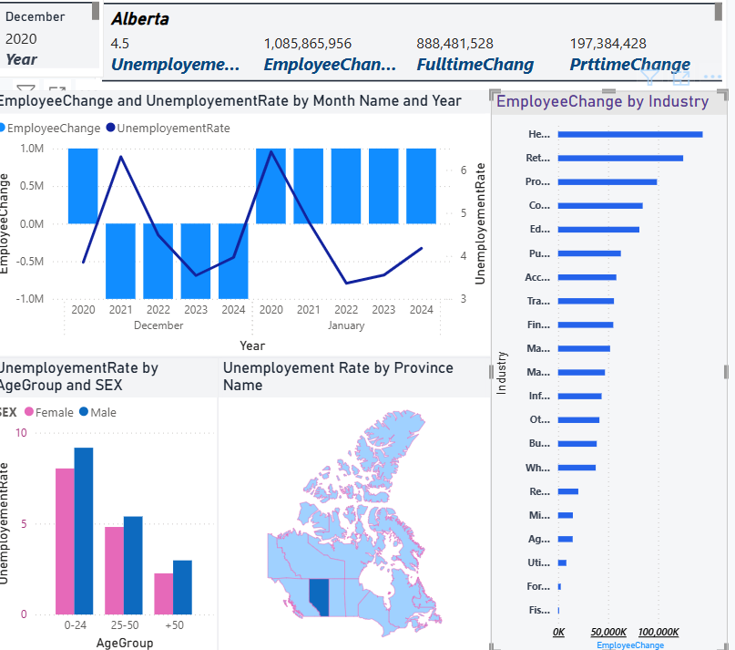
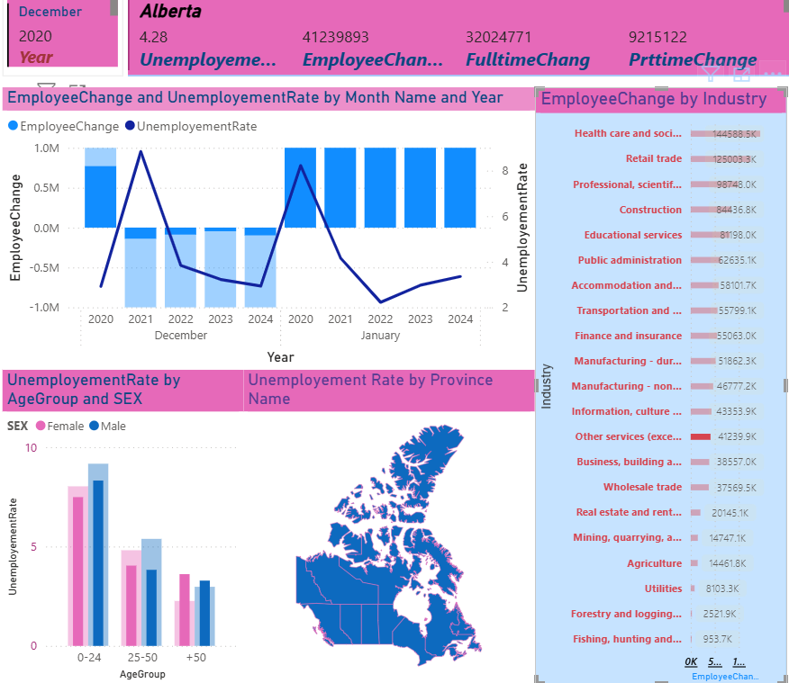

# Canadian Labour Dashboard

This Power BI project explores Canadian labour market trends using interactive dashboards and visual analytics.

## Tools Used
- Power BI
- Excel
- Data Visualization
- Data Analysis

## Dashboard Preview

### Employment Trends Dashboard

### Labour Market Dashboard

## Insights
- Employment and unemployment trends
- Labour market changes across Canada
- Industry and workforce analysis
- Interactive KPI dashboards

## Files Included
- Power BI dashboard files (.pbix)
- Dashboard screenshots
- Project documentation
